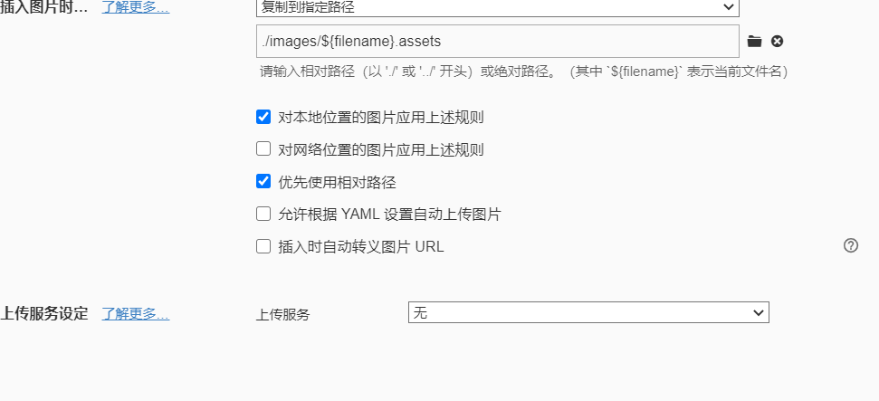

参考：

[柏码 - 让每一行代码都闪耀智慧的光芒！ (itbaima.cn)](https://www.itbaima.cn/document)

[容器概述 ：： Spring Framework](https://docs.spring.io/spring-framework/reference/core/beans/basics.html)

# 1.Spring是什么

* spring就是非入侵框架，能够整合很多框架

* 最重要的就是IOC和AOP


# 2. IOC是什么

* ioc理论


# 3. 第一个Spring 项目

1. 创建maven项目导入spring6 的y依赖

```xml
  <dependency>
            <groupId>org.springframework</groupId>
            <artifactId>spring-context</artifactId>
            <version>6.0.11</version>
  </dependency>
```

2. 在resouce目录下创建application.xml配置文件

```xml
<?xml version="1.0" encoding="UTF-8"?>
<beans xmlns="http://www.springframework.org/schema/beans"
       xmlns:xsi="http://www.w3.org/2001/XMLSchema-instance"
       xsi:schemaLocation="http://www.springframework.org/schema/beans
		https://www.springframework.org/schema/beans/spring-beans.xsd">

    <bean id="..." class="...">
        <!-- collaborators and configuration for this bean go here -->
    </bean>

    <bean id="..." class="...">
        <!-- collaborators and configuration for this bean go here -->
    </bean>

    <!-- more bean definitions go here -->

</beans>
```

3. 把实体类交给ioc容器管理，通过context去调用使用

   1. 创建一个类

      ```java
      package com.ls.pojo;
      
      public class Students {
          public void Hello(){
              System.out.println("Hello world!");
          }
      }
      ```

      

   2. 在application.xml中编写bean标签，就把类交给ioc容器处理了

   ```xml
   <?xml version="1.0" encoding="UTF-8"?>
   <beans xmlns="http://www.springframework.org/schema/beans"
          xmlns:xsi="http://www.w3.org/2001/XMLSchema-instance"
          xsi:schemaLocation="http://www.springframework.org/schema/beans
   		https://www.springframework.org/schema/beans/spring-beans.xsd">
   
       <bean class="com.ls.pojo.Students" name="st">
   
       </bean>
   
   </beans>
   ```

   3. 创建context并通过context获取对象

   ```java
   public class Main {
       public static void main(String[] args) {
           ApplicationContext context = new ClassPathXmlApplicationContext("application.xml");
   
          // Students student = (Students) context.getBean("st"); //通过名字向IOC调取使用
           Students student = context.getBean("Students.calss");//通过类型向IOC调取使用
           student.Hello();
   
       }
   }
   ```

# 4. bean的注册与配置

1. 注册就在application.xml 中添加bean标签

```xml
//class, 指定类型， name给这个对象起名 
<bean class="com.ls.pojo.Students" name="student0"/>

 <bean class="com.ls.pojo.Students" name="student0" />
 <bean class="com.ls.pojo.ArtStudent" name="artStudent"/>
 <bean class="com.ls.pojo.SportStudent" name="sportStudent"/>
//别名，也可以通过context用别名获取对象
 <alias name="sportStudent" alias="sport"/>

```

* 需要注意的是通过name或者alias获取对象的时候需要强制转换


* 以下说明了IOC帮我们管理bean的时候，同类型只创建一个bean对象。我们通过context也只能调用到同类型的一个bean实例，但是如果在注册bean时使用了name，同类型不同name，IOC会创建两个bean实例

```java
 SportStudent sport = (SportStudent) context.getBean("sportStudent");
        System.out.println(sport);

        SportStudent sport1 = (SportStudent) context.getBean("sportStudent");

        System.out.println(sport1);
```


```java
public class Main {
    public static void main(String[] args) {
        ApplicationContext context = new ClassPathXmlApplicationContext("application.xml");

        Students student0 = (Students) context.getBean("student0");
        Students student1 = (Students) context.getBean("student1");

        System.out.println(student0);
        System.out.println(student1);
    }
}
```


* scope  默认是singleton 单例模式， 也就是上述通过IOC获取对象只能获取一个对象

  ​             可选prototype  原型模式   多例模式，每次通过IOC获取的对象都是一个新的对象
  
    

```xml
<bean class="com.ls.pojo.ArtStudent" name="artStudent" scope="prototype"/>
```

```java
public class Main {
    public static void main(String[] args) {
        ApplicationContext context = new ClassPathXmlApplicationContext("application.xml");

        ArtStudent bean0 = context.getBean(ArtStudent.class);
        ArtStudent bean1 = context.getBean(ArtStudent.class);
        System.out.println(bean1);
        System.out.println(bean0);
    }
}
```


* ​	单例模式时，context创建的时候，bean实例就会创建，原型模式时，在用户申请用的时候才会创建。
  * 也说明了在IOC单例模式下管理bean时时通过无参构造器创建的对象（反射？）

```xml
    <bean class="com.ls.service.AService" name="aService"/>
```

```java
public class AService implements Service {
    public AService() {
        System.out.println("我被创建了------------");
    }
}


public class Main {
    public static void main(String[] args) {
        ApplicationContext context = new ClassPathXmlApplicationContext("application.xml");
        System.out.println("开始创建---------");
        ArtStudent bean = context.getBean(ArtStudent.class);
    }
}
```


*  相反原型模式下，需要使用该对象时才会通过IOC创建，相当与new了一个对象

```xml
  <bean class="com.ls.service.AService" name="aService" scope="prototype"/>
```

```java
public class AService implements Service {
    public AService() {
        System.out.println("我被创建了------------");
    }
}

public class Main {
    public static void main(String[] args) {
        ApplicationContext context = new ClassPathXmlApplicationContext("application.xml");
        System.out.println("开始创建---------");
        ArtStudent bean = context.getBean(ArtStudent.class);
    }
}

```


**------------------------------------------不明白为什么没有我没创建了------------------------------------------------------------------------------------**

**----------------------------------我改了一个类，上面时一个实现类，下面就是一个普通类就像预估的一样-------------------------------------**

```xml
 <bean class="com.ls.pojo.Students" name="student0" scope="prototype" />
```

```java
public class Students {
    public Students() {
        System.out.println("我被创建了-----------------");
    }
}

public class Main {
    public static void main(String[] args) {
        ApplicationContext context = new ClassPathXmlApplicationContext("application.xml");
        System.out.println("开始创建---------");
        Students bean = context.getBean(Students.class);
    }
}

```


* 懒加载，当我们不希望单例模式下总是没有使用就创建，占用资源我们可以设置懒加载`lazy-init="true"`这样我们使用到该bean实例才IOC才会创建

```xml
    <bean class="com.ls.pojo.Students" name="student0"  lazy-init="true" />
```

```java
package com.ls.pojo;

public class Students {
    public Students() {
        System.out.println("我被创建了-----------------");
    }
}

public class Main {
    public static void main(String[] args) {
        ApplicationContext context = new ClassPathXmlApplicationContext("application.xml");
        System.out.println("开始创建---------");
        Students bean = context.getBean(Students.class);

    }
}

```


# 5. DI

* DI依赖注入有两种方式一种是setter一种是参数构造器


## 5.1 setter 注入

IOC创建对象时，给对象的属性赋值时要用set方法

```java
public interface Teacher {

    void tech();
}

public class ArtTeacher implements Teacher {
    @Override
    public void tech() {
        System.out.println("教你画画");
    }
}


public class ProgramTeacher implements Teacher{
    @Override
    public void tech() {
        System.out.println("我教你编程");

    }
}


public class Student {
    private Teacher teacher ;
    private  String name;

    public void setName(String name) {
        this.name = name;
    }

    public String getName() {
        return name;
    }

    public Teacher getTeacher() {
        return teacher;
    }

    public void setTeacher(Teacher teacher) {
        this.teacher = teacher;
    }

    public void  study(){
        teacher.tech();
    }
}

```

```xml
<bean class="com.ls.pojo.ArtTeacher" name="artTeacher" />
<bean class="com.ls.pojo.ProgramTeacher" name="proTeacher" />
    <bean class="com.ls.pojo.Student" >
        <property name="teacher" ref="artTeacher"/>
        <property name="name" value="ls" />
    </bean>
```

```java
public class Main {
    public static void main(String[] args) {
        ApplicationContext context = new ClassPathXmlApplicationContext("application.xml");
        Student bean = context.getBean(Student.class);
        System.out.println(bean);
        bean.study();
        System.out.println(bean.getName());
    }
}
```


* 没有set方法会报错，说明了IOC容器DI注入的时候使用的setter方法（property）
* ref 是引用已经创建的bean对象，value是给普通属性赋值


如果业务需要该比如，学生不学美术了该学编程，如果不通过springioc的管理的话，就还要该代码，删去art，newprogramTeacher，但是现在有IOC容器去管理，只需要在xml文件里面修改DIstudent如下

```xml
 <bean class="com.ls.pojo.Student" >
        <property name="teacher" ref="proTeacher"/>
        <property name="name" value="ls" />
    </bean>
```


这就是IOC的好处


## 5.2 构造器注入

* 需要有参构造器

```java
public class Student {
    private Teacher teacher ;
    private  String name;

    public Student(Teacher teacher, String name) {
        this.teacher = teacher;
        this.name = name;
    }

    public void  study(){
        teacher.tech();
    }


    @Override
    public String toString() {
        return "Student{" +
                "teacher=" + teacher +
                ", name='" + name + '\'' +
                '}';
    }
}
```
* 第一种构造方式是通过下标index，从0开始，按照有参构造器中的参数出现先后依次赋值
```xml
    <bean class="com.ls.pojo.ArtTeacher" name="artTeacher" />
    <bean class="com.ls.pojo.ProgramTeacher" name="proTeacher" />
    <bean class="com.ls.pojo.Student" >
        <constructor-arg  index="0" ref="proTeacher"/>
        <constructor-arg  index="1" value="liShuo"/>

    </bean>
```


* 第二种构造方式是通过参数名字

```xml
<bean class="com.ls.pojo.Student" >
        <constructor-arg  name="teacher" ref="artTeacher"/>
        <constructor-arg  name="name" value="liShuo"/>

    </bean>
```


警告：Using deprecated '-debug' fallback for parameter name resolution. Compile the affected code with '-parameters' instead or avoid its introspection: com.ls.pojo.Student


* 第三种构造方式是通过参数类型匹配注入

```xml
<bean class="com.ls.pojo.ArtTeacher" name="artTeacher" />
<bean class="com.ls.pojo.ProgramTeacher" name="proTeacher" />
    <bean class="com.ls.pojo.Student" >
        <constructor-arg  type="Teacher" ref="artTeacher"/>
        <constructor-arg  type="String" value="liShuo"/>

    </bean>
```


* 还有一种自动匹配的，官方是这样描述


官方文档：[依赖注入 ：： Spring Framework](https://docs.spring.io/spring-framework/reference/core/beans/dependencies/factory-collaborators.html)

* name type 可以同时用，就是可更精准的匹配


## 5.3 特殊类型的注入

* List集合注入

```java
import java.util.List;
public class StudentList {
    private List<String> name;

    //setterDI
    public void setName(List<String> name) {
        this.name = name;
    }
    @Override
    public String toString() {
        return "StudentList{" +
                "name=" + name +
                '}';
    }
}

```

```xml
<bean class="com.ls.pojo.StudentList" name="studentList">
        <property name="name">    
            <list>
                <value>AAA</value>
                <value>BBB</value>
                <value>CCC</value>
            </list>
        </property>
</bean>
```


或者

```java
package com.ls.pojo;


import java.util.List;

public class StudentList {
    private List<String> name;

    //构造器DI
    public StudentList(List<String> name) {
        this.name = name;
    }

    @Override
    public String toString() {
        return "StudentList{" +
                "name=" + name +
                '}';
    }
}

```

```xml
<bean class="com.ls.pojo.StudentList" name="studentList">
        <constructor-arg name="name">
            <list>
                <value>AAA</value>
                <value>BBB</value>
                <value>CCC</value>
            </list>
        </constructor-arg>
</bean>
```

* 需要注意的是，DI标签里面name属性赋值是参数的名字


* Map集合注入

```java
import java.util.Map;

public class SMap {
    private Map<Integer,String> names;

    public void setNames(Map<Integer, String> names) {
        this.names = names;
    }

    @Override
    public String toString() {
        return "SMap{" +
                "names=" + names +
                '}';
    }
}


public class Main {
    public static void main(String[] args) {
        ApplicationContext context = new ClassPathXmlApplicationContext("application.xml");
        SMap bean = context.getBean(SMap.class);
        System.out.println(bean);
    }
}

```

```xml
 <bean class="com.ls.pojo.SMap" name="sMap">
        <property name="names">
            <map>
                <entry key="1" value="lishuo"/>
                <entry key="2" value="xiaoming"/>
                <entry key="3" value="xiaohong"/>

            </map>
        </property>
    </bean>
```


参数构造器DI参考第一个list

## 5.4 自动注入

autowrite

* ByType

```java
//自动装配
public class AutoStu {
    private Teacher teacher;

    public void setTeacher(Teacher teacher) {
        this.teacher = teacher;
    }

    @Override
    public String toString() {
        return "AutoStu{" +
                "teacher=" + teacher +
                '}';
    }
}

public class Main {
    public static void main(String[] args) {
        ApplicationContext context = new ClassPathXmlApplicationContext("application.xml");
        AutoStu bean = context.getBean(AutoStu.class);
        System.out.println(bean);
    }
}
```

```xml
<bean class="com.ls.pojo.ProgramTeacher" name="proTeacher" /> 
<bean class="com.ls.pojo.AutoStu"  name="autoStu" autowire="byType"/>
```


```xml
<bean class="com.ls.pojo.ArtTeacher" name="artTeacher" />
<bean class="com.ls.pojo.AutoStu"  name="autoStu" autowire="byType"/>
```


* Bytype会自动根据IOC里面已经存在的bean去注入要装配的bean**类型相同是指要装配的bean里面的属性与IOC里面已经注册过的bean类型相同**

* 如果存在多个类型相同的bean,可以使用`autowire-candidate`,`primary` 标签设置值筛选，具体在下）

```xml
<bean class="com.ls.pojo.ArtTeacher" name="artTeacher" autowire-candidate="false"/>
<bean class="com.ls.pojo.ProgramTeacher" name="proTeacher" />
<bean class="com.ls.pojo.AutoStu"  name="autoStu" autowire="byType"/>
```

autowire-condidate = "false" ,意思是自动写入候选项，false，不在候选项中


```xml
<bean class="com.ls.pojo.ArtTeacher" name="artTeacher" primary="true"/>
<bean class="com.ls.pojo.ProgramTeacher" name="proTeacher"/>
<bean class="com.ls.pojo.AutoStu"  name="autoStu" autowire="byType"/>
```


primary ="true"; 优先装备这个

----------------------------------需要注意的有-----------------------------------------

* ByType，ByName是通过setterDI的还是说autowrite是通过setterDI 的

我移除了set方法后如下

```java
package com.ls.pojo;
//自动装配
public class AutoStu {
    private Teacher teacher;

    @Override
    public String toString() {
        return "AutoStu{" +
                "teacher=" + teacher +
                '}';
    }
}

```

```xml
<bean class="com.ls.pojo.ArtTeacher" name="artTeacher" autowire-candidate="false"/>
<bean class="com.ls.pojo.ProgramTeacher" name="proTeacher" />
<bean class="com.ls.pojo.AutoStu"  name="autoStu" autowire="byType" />
```


没有报错，但是没有注入进去值


* 当IOC容器中存在多个相同类型的bean，bytype就不那么好用了，当然可以通过上述autowrite-condidate，去除候选项直到唯一无歧义，也可以primary设定用这个去装配。当然还有一种方法叫Byname

- 解释一下Byname,Byname,是通过命名相同去注入的，这里的命名相通是指setXXX的名字和IOC中bean实例的名字相同

```java
//自动装配
public class AutoStu {
    private Teacher teacher;

    public void setTeacher(Teacher teacher) {
        this.teacher = teacher;
    }

    @Override
    public String toString() {
        return "AutoStu{" +
                "teacher=" + teacher +
                '}';
    }
}

```

```xml
 <bean class="com.ls.pojo.ArtTeacher" name="artTeacher"/>
 <bean class="com.ls.pojo.ProgramTeacher" name="proTeacher" />
 <bean class="com.ls.pojo.AutoStu"  name="autoStu" autowire="byName"/>
```


没有装配上是怎么回事，**byname是看set方法名字的name和IOCbean的name，上述setTeacher和IOC—bean——name没有一致的当然没有注入成功**

修改set方法名字，想要那个装配就用setxxx如下

```java
package com.ls.pojo;
//自动装配
public class AutoStu {
    private Teacher teacher;

    //修改set
    public void setArtTeacher(Teacher teacher) {
        this.teacher = teacher;
    }

    @Override
    public String toString() {
        return "AutoStu{" +
                "teacher=" + teacher +
                '}';
    }
}

```

```xml
 <bean class="com.ls.pojo.ArtTeacher" name="artTeacher"/>
 <bean class="com.ls.pojo.ProgramTeacher" name="proTeacher" />
 <bean class="com.ls.pojo.AutoStu"  name="autoStu" autowire="byName"/>
```


* byname更没有歧义，但是需要修改set的名字


* 还有个构造器自动装配，其实也是bytype
* 参考：[Autowiring Collaborators ：： Spring Framework](https://docs.spring.io/spring-framework/reference/core/beans/dependencies/factory-autowire.html#beans-factory-autowire-candidate)


