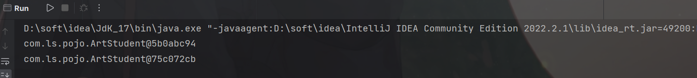
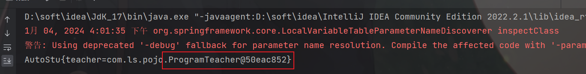
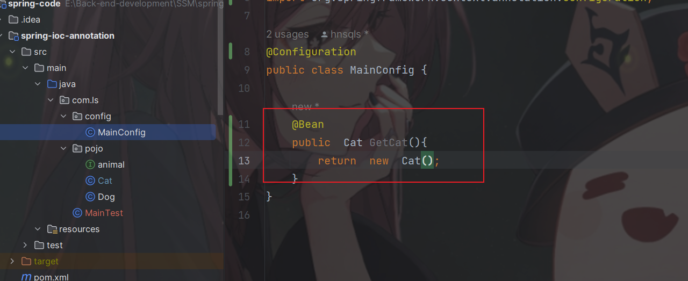
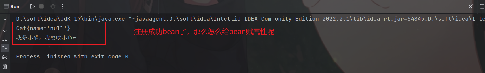

参考：

[柏码 - 让每一行代码都闪耀智慧的光芒！ (itbaima.cn)](https://www.itbaima.cn/document)

[容器概述 ：： Spring Framework](https://docs.spring.io/spring-framework/reference/core/beans/basics.html)

# 1.Spring是什么

* spring就是非入侵框架，能够整合很多框架

* 最重要的就是IOC和AOP


# 2. IOC是什么

* ioc理论


# 3. 第一个Spring 项目

1. 创建maven项目导入spring6 的y依赖

```xml
  <dependency>
            <groupId>org.springframework</groupId>
            <artifactId>spring-context</artifactId>
            <version>6.0.11</version>
  </dependency>
```

2. 在resouce目录下创建application.xml配置文件

```xml
<?xml version="1.0" encoding="UTF-8"?>
<beans xmlns="http://www.springframework.org/schema/beans"
       xmlns:xsi="http://www.w3.org/2001/XMLSchema-instance"
       xsi:schemaLocation="http://www.springframework.org/schema/beans
		https://www.springframework.org/schema/beans/spring-beans.xsd">

    <bean id="..." class="...">
        <!-- collaborators and configuration for this bean go here -->
    </bean>

    <bean id="..." class="...">
        <!-- collaborators and configuration for this bean go here -->
    </bean>

    <!-- more bean definitions go here -->

</beans>
```

3. 把实体类交给ioc容器管理，通过context去调用使用

   1. 创建一个类

      ```java
      package com.ls.pojo;
      
      public class Students {
          public void Hello(){
              System.out.println("Hello world!");
          }
      }
      ```

      

   2. 在application.xml中编写bean标签，就把类交给ioc容器处理了

   ```xml
   <?xml version="1.0" encoding="UTF-8"?>
   <beans xmlns="http://www.springframework.org/schema/beans"
          xmlns:xsi="http://www.w3.org/2001/XMLSchema-instance"
          xsi:schemaLocation="http://www.springframework.org/schema/beans
   		https://www.springframework.org/schema/beans/spring-beans.xsd">
   
       <bean class="com.ls.pojo.Students" name="st">
   
       </bean>
   
   </beans>
   ```

   3. 创建context并通过context获取对象

   ```java
   public class Main {
       public static void main(String[] args) {
           ApplicationContext context = new ClassPathXmlApplicationContext("application.xml");
   
          // Students student = (Students) context.getBean("st"); //通过名字向IOC调取使用
           Students student = context.getBean("Students.calss");//通过类型向IOC调取使用
           student.Hello();
   
       }
   }
   ```

# 4. bean的注册与配置

1. 注册就在application.xml 中添加bean标签

```xml
//class, 指定类型， name给这个对象起名 
<bean class="com.ls.pojo.Students" name="student0"/>

 <bean class="com.ls.pojo.Students" name="student0" />
 <bean class="com.ls.pojo.ArtStudent" name="artStudent"/>
 <bean class="com.ls.pojo.SportStudent" name="sportStudent"/>
//别名，也可以通过context用别名获取对象
 <alias name="sportStudent" alias="sport"/>

```

* 需要注意的是通过name或者alias获取对象的时候需要强制转换


* 以下说明了IOC帮我们管理bean的时候，同类型只创建一个bean对象。我们通过context也只能调用到同类型的一个bean实例，但是如果在注册bean时使用了name，同类型不同name，IOC会创建两个bean实例

```java
 SportStudent sport = (SportStudent) context.getBean("sportStudent");
        System.out.println(sport);

        SportStudent sport1 = (SportStudent) context.getBean("sportStudent");

        System.out.println(sport1);
```


```java
public class Main {
    public static void main(String[] args) {
        ApplicationContext context = new ClassPathXmlApplicationContext("application.xml");

        Students student0 = (Students) context.getBean("student0");
        Students student1 = (Students) context.getBean("student1");

        System.out.println(student0);
        System.out.println(student1);
    }
}
```


* scope  默认是singleton 单例模式， 也就是上述通过IOC获取对象只能获取一个对象

  ​             可选prototype  原型模式   多例模式，每次通过IOC获取的对象都是一个新的对象
  
    

```xml
<bean class="com.ls.pojo.ArtStudent" name="artStudent" scope="prototype"/>
```

```java
public class Main {
    public static void main(String[] args) {
        ApplicationContext context = new ClassPathXmlApplicationContext("application.xml");

        ArtStudent bean0 = context.getBean(ArtStudent.class);
        ArtStudent bean1 = context.getBean(ArtStudent.class);
        System.out.println(bean1);
        System.out.println(bean0);
    }
}
```




* ​	单例模式时，context创建的时候，bean实例就会创建，原型模式时，在用户申请用的时候才会创建。
  * 也说明了在IOC单例模式下管理bean时时通过无参构造器创建的对象（反射？）

```xml
    <bean class="com.ls.service.AService" name="aService"/>
```

```java
public class AService implements Service {
    public AService() {
        System.out.println("我被创建了------------");
    }
}


public class Main {
    public static void main(String[] args) {
        ApplicationContext context = new ClassPathXmlApplicationContext("application.xml");
        System.out.println("开始创建---------");
        ArtStudent bean = context.getBean(ArtStudent.class);
    }
}
```


*  相反原型模式下，需要使用该对象时才会通过IOC创建，相当与new了一个对象

```xml
  <bean class="com.ls.service.AService" name="aService" scope="prototype"/>
```

```java
public class AService implements Service {
    public AService() {
        System.out.println("我被创建了------------");
    }
}

public class Main {
    public static void main(String[] args) {
        ApplicationContext context = new ClassPathXmlApplicationContext("application.xml");
        System.out.println("开始创建---------");
        ArtStudent bean = context.getBean(ArtStudent.class);
    }
}

```


**------------------------------------------不明白为什么没有我没创建了------------------------------------------------------------------------------------**

**----------------------------------我改了一个类，上面时一个实现类，下面就是一个普通类就像预估的一样-------------------------------------**

```xml
 <bean class="com.ls.pojo.Students" name="student0" scope="prototype" />
```

```java
public class Students {
    public Students() {
        System.out.println("我被创建了-----------------");
    }
}

public class Main {
    public static void main(String[] args) {
        ApplicationContext context = new ClassPathXmlApplicationContext("application.xml");
        System.out.println("开始创建---------");
        Students bean = context.getBean(Students.class);
    }
}

```


* 懒加载，当我们不希望单例模式下总是没有使用就创建，占用资源我们可以设置懒加载`lazy-init="true"`这样我们使用到该bean实例才IOC才会创建

```xml
    <bean class="com.ls.pojo.Students" name="student0"  lazy-init="true" />
```

```java
package com.ls.pojo;

public class Students {
    public Students() {
        System.out.println("我被创建了-----------------");
    }
}

public class Main {
    public static void main(String[] args) {
        ApplicationContext context = new ClassPathXmlApplicationContext("application.xml");
        System.out.println("开始创建---------");
        Students bean = context.getBean(Students.class);

    }
}

```


# 5. DI

* DI依赖注入有两种方式一种是setter一种是参数构造器


## 5.1 setter 注入

IOC创建对象时，给对象的属性赋值时要用set方法

```java
public interface Teacher {

    void tech();
}

public class ArtTeacher implements Teacher {
    @Override
    public void tech() {
        System.out.println("教你画画");
    }
}


public class ProgramTeacher implements Teacher{
    @Override
    public void tech() {
        System.out.println("我教你编程");

    }
}


public class Student {
    private Teacher teacher ;
    private  String name;

    public void setName(String name) {
        this.name = name;
    }

    public String getName() {
        return name;
    }

    public Teacher getTeacher() {
        return teacher;
    }

    public void setTeacher(Teacher teacher) {
        this.teacher = teacher;
    }

    public void  study(){
        teacher.tech();
    }
}

```

```xml
<bean class="com.ls.pojo.ArtTeacher" name="artTeacher" />
<bean class="com.ls.pojo.ProgramTeacher" name="proTeacher" />
    <bean class="com.ls.pojo.Student" >
        <property name="teacher" ref="artTeacher"/>
        <property name="name" value="ls" />
    </bean>
```

```java
public class Main {
    public static void main(String[] args) {
        ApplicationContext context = new ClassPathXmlApplicationContext("application.xml");
        Student bean = context.getBean(Student.class);
        System.out.println(bean);
        bean.study();
        System.out.println(bean.getName());
    }
}
```


* 没有set方法会报错，说明了IOC容器DI注入的时候使用的setter方法（property）
* ref 是引用已经创建的bean对象，value是给普通属性赋值


如果业务需要该比如，学生不学美术了该学编程，如果不通过springioc的管理的话，就还要该代码，删去art，newprogramTeacher，但是现在有IOC容器去管理，只需要在xml文件里面修改DIstudent如下

```xml
 <bean class="com.ls.pojo.Student" >
        <property name="teacher" ref="proTeacher"/>
        <property name="name" value="ls" />
    </bean>
```


这就是IOC的好处


## 5.2 构造器注入

* 需要有参构造器

```java
public class Student {
    private Teacher teacher ;
    private  String name;

    public Student(Teacher teacher, String name) {
        this.teacher = teacher;
        this.name = name;
    }

    public void  study(){
        teacher.tech();
    }


    @Override
    public String toString() {
        return "Student{" +
                "teacher=" + teacher +
                ", name='" + name + '\'' +
                '}';
    }
}
```
* 第一种构造方式是通过下标index，从0开始，按照有参构造器中的参数出现先后依次赋值
```xml
    <bean class="com.ls.pojo.ArtTeacher" name="artTeacher" />
    <bean class="com.ls.pojo.ProgramTeacher" name="proTeacher" />
    <bean class="com.ls.pojo.Student" >
        <constructor-arg  index="0" ref="proTeacher"/>
        <constructor-arg  index="1" value="liShuo"/>

    </bean>
```


* 第二种构造方式是通过参数名字

```xml
<bean class="com.ls.pojo.Student" >
        <constructor-arg  name="teacher" ref="artTeacher"/>
        <constructor-arg  name="name" value="liShuo"/>

    </bean>
```


警告：Using deprecated '-debug' fallback for parameter name resolution. Compile the affected code with '-parameters' instead or avoid its introspection: com.ls.pojo.Student


* 第三种构造方式是通过参数类型匹配注入

```xml
<bean class="com.ls.pojo.ArtTeacher" name="artTeacher" />
<bean class="com.ls.pojo.ProgramTeacher" name="proTeacher" />
    <bean class="com.ls.pojo.Student" >
        <constructor-arg  type="Teacher" ref="artTeacher"/>
        <constructor-arg  type="String" value="liShuo"/>

    </bean>
```


* 还有一种自动匹配的，官方是这样描述


官方文档：[依赖注入 ：： Spring Framework](https://docs.spring.io/spring-framework/reference/core/beans/dependencies/factory-collaborators.html)

* name type 可以同时用，就是可更精准的匹配


## 5.3 特殊类型的注入

* List集合注入

```java
import java.util.List;
public class StudentList {
    private List<String> name;

    //setterDI
    public void setName(List<String> name) {
        this.name = name;
    }
    @Override
    public String toString() {
        return "StudentList{" +
                "name=" + name +
                '}';
    }
}

```

```xml
<bean class="com.ls.pojo.StudentList" name="studentList">
        <property name="name">    
            <list>
                <value>AAA</value>
                <value>BBB</value>
                <value>CCC</value>
            </list>
        </property>
</bean>
```


或者

```java
package com.ls.pojo;


import java.util.List;

public class StudentList {
    private List<String> name;

    //构造器DI
    public StudentList(List<String> name) {
        this.name = name;
    }

    @Override
    public String toString() {
        return "StudentList{" +
                "name=" + name +
                '}';
    }
}

```

```xml
<bean class="com.ls.pojo.StudentList" name="studentList">
        <constructor-arg name="name">
            <list>
                <value>AAA</value>
                <value>BBB</value>
                <value>CCC</value>
            </list>
        </constructor-arg>
</bean>
```

* 需要注意的是，DI标签里面name属性赋值是参数的名字


* Map集合注入

```java
import java.util.Map;

public class SMap {
    private Map<Integer,String> names;

    public void setNames(Map<Integer, String> names) {
        this.names = names;
    }

    @Override
    public String toString() {
        return "SMap{" +
                "names=" + names +
                '}';
    }
}


public class Main {
    public static void main(String[] args) {
        ApplicationContext context = new ClassPathXmlApplicationContext("application.xml");
        SMap bean = context.getBean(SMap.class);
        System.out.println(bean);
    }
}

```

```xml
 <bean class="com.ls.pojo.SMap" name="sMap">
        <property name="names">
            <map>
                <entry key="1" value="lishuo"/>
                <entry key="2" value="xiaoming"/>
                <entry key="3" value="xiaohong"/>

            </map>
        </property>
    </bean>
```


参数构造器DI参考第一个list

## 5.4 自动注入

autowrite

* ByType

```java
//自动装配
public class AutoStu {
    private Teacher teacher;

    public void setTeacher(Teacher teacher) {
        this.teacher = teacher;
    }

    @Override
    public String toString() {
        return "AutoStu{" +
                "teacher=" + teacher +
                '}';
    }
}

public class Main {
    public static void main(String[] args) {
        ApplicationContext context = new ClassPathXmlApplicationContext("application.xml");
        AutoStu bean = context.getBean(AutoStu.class);
        System.out.println(bean);
    }
}
```

```xml
<bean class="com.ls.pojo.ProgramTeacher" name="proTeacher" /> 
<bean class="com.ls.pojo.AutoStu"  name="autoStu" autowire="byType"/>
```


```xml
<bean class="com.ls.pojo.ArtTeacher" name="artTeacher" />
<bean class="com.ls.pojo.AutoStu"  name="autoStu" autowire="byType"/>
```


* Bytype会自动根据IOC里面已经存在的bean去注入要装配的bean**类型相同是指要装配的bean里面的属性与IOC里面已经注册过的bean类型相同**

* 如果存在多个类型相同的bean,可以使用`autowire-candidate`,`primary` 标签设置值筛选，具体在下）

```xml
<bean class="com.ls.pojo.ArtTeacher" name="artTeacher" autowire-candidate="false"/>
<bean class="com.ls.pojo.ProgramTeacher" name="proTeacher" />
<bean class="com.ls.pojo.AutoStu"  name="autoStu" autowire="byType"/>
```

autowire-condidate = "false" ,意思是自动写入候选项，false，不在候选项中



```xml
<bean class="com.ls.pojo.ArtTeacher" name="artTeacher" primary="true"/>
<bean class="com.ls.pojo.ProgramTeacher" name="proTeacher"/>
<bean class="com.ls.pojo.AutoStu"  name="autoStu" autowire="byType"/>
```


primary ="true"; 优先装备这个

----------------------------------需要注意的有-----------------------------------------

* ByType，ByName是通过setterDI的还是说autowrite是通过setterDI 的

我移除了set方法后如下

```java
package com.ls.pojo;
//自动装配
public class AutoStu {
    private Teacher teacher;

    @Override
    public String toString() {
        return "AutoStu{" +
                "teacher=" + teacher +
                '}';
    }
}

```

```xml
<bean class="com.ls.pojo.ArtTeacher" name="artTeacher" autowire-candidate="false"/>
<bean class="com.ls.pojo.ProgramTeacher" name="proTeacher" />
<bean class="com.ls.pojo.AutoStu"  name="autoStu" autowire="byType" />
```


没有报错，但是没有注入进去值


* 当IOC容器中存在多个相同类型的bean，bytype就不那么好用了，当然可以通过上述autowrite-condidate，去除候选项直到唯一无歧义，也可以primary设定用这个去装配。当然还有一种方法叫Byname

- 解释一下Byname,Byname,是通过命名相同去注入的，这里的命名相通是指setXXX的名字和IOC中bean实例的名字相同

```java
//自动装配
public class AutoStu {
    private Teacher teacher;

    public void setTeacher(Teacher teacher) {
        this.teacher = teacher;
    }

    @Override
    public String toString() {
        return "AutoStu{" +
                "teacher=" + teacher +
                '}';
    }
}

```

```xml
 <bean class="com.ls.pojo.ArtTeacher" name="artTeacher"/>
 <bean class="com.ls.pojo.ProgramTeacher" name="proTeacher" />
 <bean class="com.ls.pojo.AutoStu"  name="autoStu" autowire="byName"/>
```


没有装配上是怎么回事，**byname是看set方法名字的name和IOCbean的name，上述setTeacher和IOC—bean——name没有一致的当然没有注入成功**

修改set方法名字，想要那个装配就用setxxx如下

```java
package com.ls.pojo;
//自动装配
public class AutoStu {
    private Teacher teacher;

    //修改set
    public void setArtTeacher(Teacher teacher) {
        this.teacher = teacher;
    }

    @Override
    public String toString() {
        return "AutoStu{" +
                "teacher=" + teacher +
                '}';
    }
}

```

```xml
 <bean class="com.ls.pojo.ArtTeacher" name="artTeacher"/>
 <bean class="com.ls.pojo.ProgramTeacher" name="proTeacher" />
 <bean class="com.ls.pojo.AutoStu"  name="autoStu" autowire="byName"/>
```


* byname更没有歧义，但是需要修改set的名字


* 还有个构造器自动装配，其实也是bytype
* 参考：[Autowiring Collaborators ：： Spring Framework](https://docs.spring.io/spring-framework/reference/core/beans/dependencies/factory-autowire.html#beans-factory-autowire-candidate)


# 6 注解开发—IOC

* 因为在开发中使用xml文件配置的话，bean会很多，xml文件会被bean充满，而且会继续庞大下去---------》解决这个问题的方法就是注解开发


使用注解开发就不需要之前的application.xml配置文件

```xml
<?xml version="1.0" encoding="UTF-8"?>
<beans xmlns="http://www.springframework.org/schema/beans"
       xmlns:xsi="http://www.w3.org/2001/XMLSchema-instance"
       xsi:schemaLocation="http://www.springframework.org/schema/beans
		https://www.springframework.org/schema/beans/spring-beans.xsd">
</beans>
```

删除即可，但是我们需要一个配置类 

`@configuration`

```java
@Configuration
public class MainConfig {
}

```


怎么拿到上下问呢，现在没有了application.xml文件

之前有配置文件的时候是

```java
 ApplicationContext context = new ClassPathXmlApplicationContext("application.xml");
```

现在使用注解开发没有xml文件 有的只是配置类

```java
ApplicationContext context = new AnnotationConfigApplicationContext(MainConfig.class);
```

通过配置类拿到上下文


**注册bean**

> @Bean

在配置类中使用注解@bean 在一个类上，就能将该类注册为bean

```java
public interface animal {
    void eat();
}

public class Cat implements  animal{

    private  String name;

    @Override
    public void eat() {
        System.out.println("我是小猫，我要吃小鱼~");
    }


    @Override
    public String toString() {
        return "Cat{" +
                "name='" + name + '\'' +
                '}';
    }
}


public class Dog implements  animal{
    private  String name;

    @Override
    public void eat() {
        System.out.println("我是狗爱吃骨头~");
    }
}

```





测试

```java
public class MainTest {
    public static void main(String[] args) {
        ApplicationContext context = new AnnotationConfigApplicationContext(MainConfig.class);
        Cat bean = context.getBean(Cat.class);
        System.out.println(bean);
        bean.eat();
    }
```




xml文件和注解的比较

在xml文件中beans <bean>中注册

```xml
 <bean class="com.ls.pojo.ArtTeacher" name="artTeacher"/>


```


在注解开发中，在@Configuration 配置类下的@Bean下注册

```java
 @Bean
    public  Cat GetCat(){
        return  new  Cat();
    }
```

补充

@Bean的原码


不同的参数 name  autowireCandidate initMEthod destoryMEthod，是和xml里面是一致的


* name也就是别名获取的时候要强制转换

但是好像还是xml的功能更多，能设置name ,别名，id,初始化方法，破坏方法，自动装配，继承，懒加载，DI，scope

在注解开发中@Bean能做的也就上图那么多其他配置有其他注解完成还

```java
    @Lazy(value = true)   //lazy-init
    @Scope("prototype")   //scope
    @DependsOn("dog")           //优先加载
    @Bean(name = "cat",initMethod = "",destroyMethod = "",autowireCandidate = false,)
    public  Cat GetCat(){
        return  new  Cat();
    }
```

>@Component 

**@Component 和@Componentscan 配合使用**

使用bean还要自己new对象，使用Component，就会自动注册成bean，但是需要在配置类上添加@ComponentScan 扫描需要注册bean的包，会将报下所有添加@Component的注册成bean

```java
@Component
public class Cat implements  animal{
    @Override
    public void eat() {
        System.out.println("我是小猫，我要吃小鱼~");
    }
}
```

```java
@Configuration
@ComponentScan("com.ls.pojo")
public class MainConfig {
   
}
```

```java
public class MainTest {
    public static void main(String[] args) {
        ApplicationContext context = new AnnotationConfigApplicationContext(MainConfig.class);
        Cat bean =  context.getBean(Cat.class);
        System.out.println(bean);
        bean.eat();

    }
}
```


> DI

对于那些我们需要通过构造方法或是Setter完成依赖注入的Bean，比如：

```java
<bean name="teacher" class="com.test.bean.ProgramTeacher"/>
<bean name="student" class="com.test.bean.Student">
    <property name="teacher" ref="teacher"/>
</bean>
```

像这种需要引入其他Bean进行的注入，我们可以直接将其作为形式参数放到方法中：

```java 
@Configuration
public class MainConfiguration {
    @Bean
    public Teacher teacher(){
        return new Teacher();
    }

    @Bean
    public Student student(Teacher teacher){
        return new Student(teacher);
    }
}
```


> **装配bean**

**@autowrite**


# 7 SpringAOP

## 7.1什么是AOP

参考:[AOP Concepts :: Spring Framework](https://docs.spring.io/spring-framework/reference/core/aop/introduction-defn.html)

AOP（Aspect Oriented Programming）思想实际上就是：在运行时，动态地将代码切入到类的指定方法、指定位置上。也就是说，我们可以使用AOP来帮助我们在方法执行前或执行之后，做一些额外的操作，实际上，它就是代理！

通过AOP我们可以在保证原有业务不变的情况下，添加额外的动作，比如我们的某些方法执行完成之后，需要打印日志，那么这个时候，我们就可以使用AOP来帮助我们完成，它可以批量地为这些方法添加动作。可以说，它相当于将我们原有的方法，在不改变源代码的基础上进行了增强处理。


这里介绍一下 AOP 领域中的特性术语，防止自己下来看不懂文章：

+ 通知（Advice）: AOP 框架中的增强处理，通知描述了切面何时执行以及如何执行增强处理，也就是我们上面编写的方法实现。
+ 连接点（join point）: 连接点表示应用执行过程中能够插入切面的一个点，这个点可以是方法的调用、异常的抛出，实际上就是我们在方法执行前或是执行后需要做的内容。
+ 切点（PointCut）: 可以插入增强处理的连接点，可以是方法执行之前也可以方法执行之后，还可以是抛出异常之类的。
+ 切面（Aspect）: 切面是通知和切点的结合，我们之前在xml中定义的就是切面，包括很多信息。
+ 引入（Introduction）：引入允许我们向现有的类添加新的方法或者属性。
+ 织入（Weaving）: 将增强处理添加到目标对象中，并创建一个被增强的对象，我们之前都是在将我们的增强处理添加到目标对象，也就是织入（这名字挺有文艺范的）

## 7.2使用配置实现AOP

xml文件

之前只使用IOC的配置是

```xml
<?xml version="1.0" encoding="UTF-8"?>
<beans xmlns="http://www.springframework.org/schema/beans"
       xmlns:xsi="http://www.w3.org/2001/XMLSchema-instance"
       xsi:schemaLocation="http://www.springframework.org/schema/beans
		https://www.springframework.org/schema/beans/spring-beans.xsd">
</beans>
```

现在使用AOP要添加aop相关约束

```xml
<?xml version="1.0" encoding="UTF-8"?>
<beans xmlns="http://www.springframework.org/schema/beans"
       xmlns:xsi="http://www.w3.org/2001/XMLSchema-instance"
       xmlns:aop="http://www.springframework.org/schema/aop"
       xsi:schemaLocation="http://www.springframework.org/schema/beans http://www.springframework.org/schema/beans/spring-beans.xsd
       http://www.springframework.org/schema/aop http://www.springframework.org/schema/aop/spring-aop.xsd">
</beans>
```

Spring是支持AOP编程的框架之一（实际上它整合了AspectJ框架的一部分），要使用AOP我们需要先导入一个依赖：

下面只给出spring-aop的依赖，但是不要忘记添加spring的依赖

```xml
<!-- https://mvnrepository.com/artifact/org.springframework/spring-aop -->
<dependency>
    <groupId>org.springframework</groupId>
    <artifactId>spring-aop</artifactId>
    <version>6.0.3</version>
</dependency>
```

* 还要加入aspectjweaver依赖， 因为没这个依赖下面有个bug

```xml
<dependency>
            <groupId>org.aspectj</groupId>
            <artifactId>aspectjweaver</artifactId>
            <version>1.9.6</version>
</dependency>
```


官方文档下也指出[启用@AspectJ支持 ：： Spring Framework](https://docs.spring.io/spring-framework/reference/core/aop/ataspectj/aspectj-support.html)


如何使用AOP要想AOP是干嘛的**动态地将代码切入到类的指定方法、指定位置上。也就是说，我们可以使用AOP来帮助我们在方法执行前或执行之后**

1. 需要切入的类
2. 需要切入的类的位置，即在哪个方法切入
3. 是实行方法前切入还是执行方法后切入
4. 切入后执行什么动作
5. spring怎么知道要进行切入

eg：我们希望对`Dog`类的`eat`方法进行增强，也就是在不修改源代码的情况下，增加额外的操作


```java 
public class Dog {
    
    //我们希望在eat前增减，使用AOP添加提示小狗已经3天没吃饭了~，很饿饿饿~~
    public void eat(){
        System.out.println("我要吃骨头~~~~");
    }
}
```

创建一个新的类，写要添加的操作

```java
public class DogAop {
    public void eatRequire(){
        System.out.println("小狗已经3天没吃饭了~很饿很饿饿很饿饿饿饿饿············");
    }
}
```

当然要将这两个类注册成bean

```xml
<bean id="dog" class="com.ls.pojo.Dog"/>
<bean id="dogAop" class="com.ls.aop.DogAop"/>
```

我们以上都清楚了，要将我们写的不通过代码的修改，使的程序执行`Dog的eat方法前` 执行DogAop

怎么让spring也明白我们的意思？

配置xml

在该标签中配置AOP的信息，包括切点，和切点前还是切点后以及执行方法

```xml
<aop:config>
        
</aop:config>
```

紧接着创建切点，id 随意取，expression指定需要插入的位置

```xml
<aop:config>
        <aop:pointcut id="dogEat" expression=""/>
</aop:config>
```


`execution()`格式如下

```xml
修饰符 包名.类名.方法名称(方法参数)
```

+ 修饰符：public、protected、private、包括返回值类型、static等等（使用*代表任意修饰符）
+ 包名：如com.test（* 代表全部，比如com.*代表com包下的全部包）
+ 类名：使用*也可以代表包下的所有类
+ 方法名称：可以使用*代表全部方法
+ 方法参数：填写对应的参数即可，比如(String, String)，也可以使用*来代表任意一个参数，使用..代表所有参数。

详细信息[Declaring a Pointcut :: Spring Framework](https://docs.spring.io/spring-framework/reference/core/aop/ataspectj/pointcuts.html)

所以

```xml
<aop:pointcut id="dogEat" expression="execution(* com.ls.pojo.Dog.eat())"/>
```

然后指出增强方法 用ref指向我们注册 的增强方法的bean

```xml
<aop:aspect ref="dogAop">

</aop:aspect>    
```

接着就是添加后续动作了，当然，官方支持的有多种多样的，比如执行前、执行后、抛出异常后、方法返回后等等：


本例子是增强前所以选择aop:before

method 就是我们的增强方法 ，pointcut-ref指向我们的切入点，也就是我们刚刚创建的切入点

```xml
<aop:before method="eatRequire" pointcut-ref="dogEat"/>
```


创建bean失败？，

```java
Error creating bean with name 'org.springframework.aop.aspectj.AspectJPointcutAdvisor#0': Cannot create inner bean '(inner bean)#e056f20' of type [org.springframework.aop.aspectj.AspectJMethodBeforeAdvice] while setting constructor argument
```


我以为是spring IOC和AOP的版本不一样导致的， 但是我更换了一致的版本还是不行


还是报错

经过搜素，在spring中使用AOP，还要创建bean 的话，需要引入aspectjweaver依赖

```xml
<dependency>
            <groupId>org.aspectj</groupId>
            <artifactId>aspectjweaver</artifactId>
            <version>1.9.6</version>
 </dependency>
```


解决


又遇到一个bug说我的表达式不合法


查看我的切入点表达式


写错了,选择execution（）

```xml
<aop:pointcut id="dogEat" expression="execution(* com.ls.pojo.Dog.eat())"/>
```

解决

测试

```java
public class MainTest {
    public static void main(String[] args) {
        ApplicationContext context = new ClassPathXmlApplicationContext("application.xml");
        Dog dog = context.getBean(Dog.class);
        dog.eat();
    }
}
```

结果如下


可以看到在我们原本的方法执行前，先执行了我们的增强方法，这实际上就是动态代理做到的，实现在不修改原有代码的基础上，对方法的调用进行各种增强，在之后的SpringMVC学习中，我们甚至可以使用它来快速配置访问日志打印。

前面我们说了，AOP是基于动态代理实现的，所以说我们如果直接获取Bean的类型，会发现不是原本的类型了：

```java
 Dog dog = context.getBean(Dog.class);
 System.out.println(dog.getClass());
```


想一下，AOP也就是动态的添加代码，在不改变源代码的基础上添加功能，对于特定的一些类，添加特定的增强代码，往往有参数，那么怎么在不该变源代码的基础上编写aop类还能是哟原来代码中方法的参数呢？

> JoinPoint参数，能很好的解决这个问题

修改Dog中eat（）方法，需要参数

eg : 这次我们再次添加一个执行后方法，获得参数做出回应

```java
public class Dog {
    public  void eat(String str){
        System.out.println("小狗要吃骨头~~~~");
        System.out.println("小狗还要吃"+str);
    }
}
```

怎么拿到str？这个时候，我们可以为我们切入的方法添加一个JoinPoint参数，通过此参数就可以快速获取切点位置的一些信息

JoinPonit的getargs()方法是获取被切入的方法的参数，下标从0开始

```java
public class DogAop {
    public void eatRequire(){
        System.out.println("小狗已经3天没吃饭了~很饿很饿饿很饿饿饿饿饿············");
    }
    //新增施行后增强的方法， JoinPoint的使用
    public void eatAfter(JoinPoint joinPoint){
        System.out.println("马上去买" + joinPoint.getArgs()[0]);
    }
}
```

因为eat（）变成了eat（String）方法所以切入点也要修改，此外还要添加一个执行后方法

```xml
 <aop:config>
        <aop:pointcut id="dogEat" expression="execution(* com.ls.pojo.Dog.eat(String))"/>
        <aop:aspect ref="dogAop">
            <aop:before method="eatRequire" pointcut-ref="dogEat"/>
            <aop:after method="eatAfter" pointcut-ref="dogEat"/>
        </aop:aspect>
    </aop:config>
```

测试

```java
public class MainTest {
    public static void main(String[] args) {
        ApplicationContext context = new ClassPathXmlApplicationContext("application.xml");
        Dog dog = context.getBean(Dog.class);
        dog.eat("狗粮");
    }
}
```

结果如下


我们接着来看自定义度更高的环绕方法，现在我们希望在方法执行前和执行后都加入各种各样的动作，如果还是一个一个切点写，有点太慢了，能不能直接写一起呢，此时我们就可以使用环绕方法。

环绕方法相当于完全代理了此方法，它完全将此方法包含在中间，需要我们手动调用才可以执行此方法，并且我们可以直接获取更多的参数：(动态代理---坑)

## 7.3使用接口实现AOP

## 7.4 使用注解实现AOP

不需要xml文件

需要一个配置类

```java
@Configuration
@ComponentScan("com.ls.pojo")
@ComponentScan("com.ls.aop")  //扫包扫描包中@Component所注释的类，注册成bean
@EnableAspectJAutoProxy //使用注解Aop要开启
public class MainConfig {
}
```

```java
@Component
public class Cat {
    public void action(){
        System.out.println("小猫正在睡懒觉");
    }
}

```

编写增强类

在Cat的action()方法之前增强方法 询问（"小猫在干吗？"）

需要注意的是，使用注解开发，@component只是注册成bean，需要特别@Aspect 说明该类是增强类，在增强方法上使用@Before（）

内容为切入点

```java
@Component
@Aspect
public class CatAop {
    @Before("execution(* com.ls.pojo.Cat.action())")
    public void beforeAction(){
        System.out.println("小猫正在干吗？");
    }
}
```

测试

```java
public class MainTest {
    public static void main(String[] args) {
        ApplicationContext context = new AnnotationConfigApplicationContext(MainConfig.class);
        Cat bean = context.getBean(Cat.class);
        bean.action();
    }
}

```

结果如下，说明在执行Cat类action（）方法之前成功的加入了我们的增强类


对于参数的获取呢，和使用xml使用AOP一样，直接在传参 JoinPoint

我们给小猫个参数，并在此基础上编写个执行后增强，获取参数做出提示

```java
@Component
public class Cat {
    public void action(String str){
        System.out.println("小猫正在" +str);
    }
}
```

编写增强方法,注意切入点的位置我们修改了action方法的参数

```java
@Component
@Aspect
public class CatAop {
    @Before("execution(* com.ls.pojo.Cat.action(String))")
    public void beforeAction(){
        System.out.println("小猫正在干吗？");
    }
    @After("execution(* com.ls.pojo.Cat.action(String))")
    public void afterAction(JoinPoint joinPoint){
        System.out.println("小猫正在"+joinPoint.getArgs()[0] +"不要打断它~");
    }
}
```

测试

```java
public class MainTest {
    public static void main(String[] args) {
        ApplicationContext context = new AnnotationConfigApplicationContext(MainConfig.class);
        Cat bean = context.getBean(Cat.class);
        bean.action("睡觉~");
    }
}
```

结果如下


除了使用参数JoinPoint ,还可以绑定参数

